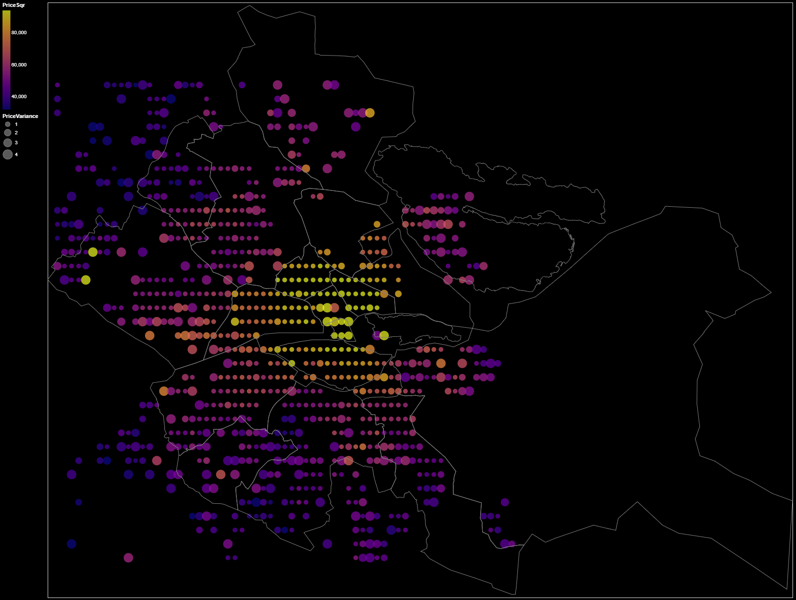

stockholm-price-map
======

Makes use of the API from https://www.svenskfast.se/kampanj/mellan-tummen-och-pekfingret/priskarta/ to display a city-wide housing price/sqm map.

Run
------

```bash
conda env create -f environment.yaml
conda activate stockholm-price-map

# inspect visualize.ipynb
jupyter lab

# OR

# crawl the API
python crawl_realestate_data.py -h
```

Map
------

Data has been clipped to 1-95 percentiles to improve visibility.

Freshness: 2020-07-19. Price in SEK.


